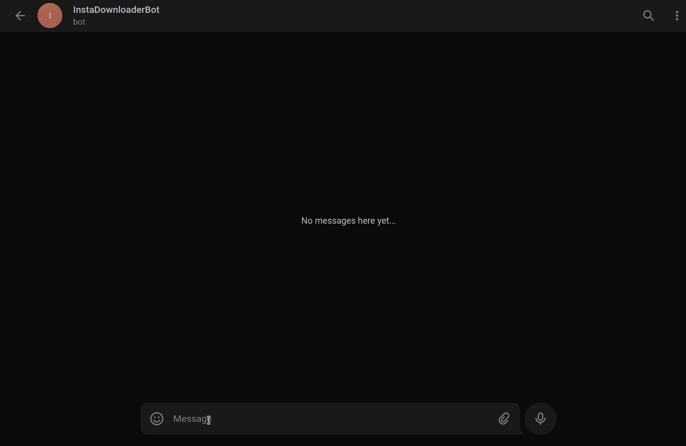

# Telegrambot-for-Instagram

This telegram bot is used for downloading public posts from instagram and everyone's DP. (Private Profile pictures also)

# PS : BOT is Working 🥳
[](https://t.me/vinayak_09)

### Tutorial to Get Working BOT
[Click Here To Open Youtube Link](https://youtu.be/TlUgnOJqrcs)


### Before running this project
* If chrome not installed Install it.
* Open Chrome and Check for Version in Help-->About Chrome
* Open [Chromedriver Download Page](https://sites.google.com/a/chromium.org/chromedriver/downloads) and download driver with version matching with Your Chrome version.
* Extract zip you will get __chromedriver__

### Follow this steps to get your bot Working:
    Note : BotFather is telegrams official bot to create other bots.
* Send /newbot command to [@BotFather](https://t.me/BotFather)
* Now send your bot name to botfather. eg InstaDownloaderBot
* Now send username for your bot it must ends with 'bot'. eg instascrapper_bot
* Congratulations ! Your bot is created successfully.
* Now copy HTTP API token and keep it secure.
* Download and unzip above source code.
* Open terminal/console to telegrambot-for-instagram
* Run following command in CMD/Console
 __pip install -r requirements.txt__
* Open InstagramScraperBot.py and search line number 18 and replace 'YOUR_TOKEN_HERE' with your HTTP API token which we got from @BotFather and save it.
* Copy __webdriver__ downloaded above to folder where InstagramSracperBot.py is located.
* If you are on Windows uncomment Line Number 34
* If you are on Linux uncomment Line Number 31
* Find line number 39 & 41 and add your instagram USERNAME and PASSWORD
* __Save the code and run using command *python InstagramSracperBot.py*__
* It will open chrome window and automatically goes to Instagram.com and Login with Your Username and Password
* If instagram asks you for OTP enter it and after __successful Login__ check if your bot replies you or not.
* After successful running this bot you can uncomment lines from 21 to 25 *to Disable Chrome GUI* 
* Re-run Bot And Check Your bot Is Replying you.


## How to deploy on Heroku

This is now tested only locally. To run on heroku we need to setup some plugins there.

```bash
WILL UPDATE THIS AFTER SUCCESSFUL TESTING WITH HEROKU
```


## Usage

#### How to get profile pic ?
  * Simply send this to bot -> /instadp username
  * Bot will send image in a while !
#### How to get all photos of user ?
  * Simply send this to bot -> /instaAllPhotos username
  * Bot will send all iamges 1 by 1

## Contributing
Pull requests are welcome.

# Contact
[](https://t.me/vinayak_09)

